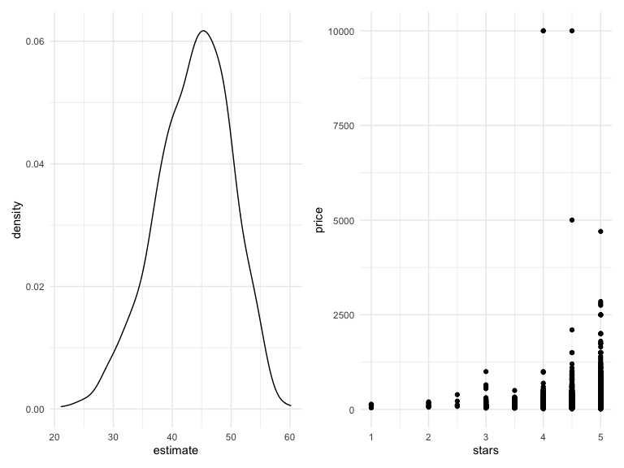

Bootstrapping
================

``` r
library(tidyverse)
```

    ## ── Attaching packages ─────────────────────────────────────── tidyverse 1.3.1 ──

    ## ✓ ggplot2 3.3.5     ✓ purrr   0.3.4
    ## ✓ tibble  3.1.4     ✓ dplyr   1.0.7
    ## ✓ tidyr   1.1.3     ✓ stringr 1.4.0
    ## ✓ readr   2.0.1     ✓ forcats 0.5.1

    ## ── Conflicts ────────────────────────────────────────── tidyverse_conflicts() ──
    ## x dplyr::filter() masks stats::filter()
    ## x dplyr::lag()    masks stats::lag()

``` r
library(viridis)
```

    ## Loading required package: viridisLite

``` r
library(modelr)
library(p8105.datasets)

library(patchwork)

knitr::opts_chunk$set(
  echo = TRUE,
  warning = FALSE, 
  fig.width = 8, 
  fig.height = 6, 
  out.width = "90%"
)
theme_set(theme_minimal() + theme(legend.position = "bottom"))

options(
  ggplot2.continuous.colour = "viridis",
  ggplot2.continuous.fill = "virids"
)

scale_colour_discrete = scale_color_viridis_d
scale_fill_discrete = scale_fill_viridis_d
```

Bootstrapping

-   idea is to mimic repeated sampling with the one sample you have

-   your sample is drawn at random from your population

\*\* you’d like to draw more samples but can’t

\*\* so you draw a bootstrap sample from one sample you have (sample
with replacement)

\*\* the bootstrap sample has the same size as the original sample and
is drawn with replacement

\*\* analyze this sample using whatever appraoch you want to apply

\*\* repeat

-   the repeated sampling framework often provides useful theoretical
    results under certain assumptions and/or asymptotics

\*\* sample means follow a known distribution \*\* regression
coefficients follow a known distribituion \*\* ORs follow a known
distribution

-   if assumptions aren’t met - or sample isn’t large enough for
    asymptotics, you can’t use “known distribution”

-   bootstrapping gets back to repeated sampling, and uses empirical
    rather than theoretical distribution of your statistic of interest

Coding the bootstrap

-   natural application of iterative tools

-   write function (or functions) to: \*\* draw a sample with
    replacement \*\* analyze the sample \*\* return object of interest

-   repeat process many times

-   keeping track of the bootstrap samples, analysis, and results in a
    single data frame that organizes the process and prevents mistakes

-   use list columns

Bootstrapping vs. cross-validation

-   similar

-   get lots of data sets, run regression, results

-   bootstrapping \*\* inference on some model parameter (CI for
    regression coefficient but don’t trust usual statistics machinery,
    or CI for correlation that is close to 1) \*\* can’t trust normal
    thing that you would do \*\* inference on some parameter or
    inference on some model componeent (sometimes p-value) \*\* here is
    the model - how to put CI on this thing, how to do….

-   cross validation \*\* how well this model works on different data
    set \*\* both looking at one data set and thinking about if extended
    to whole population \*\* prediction accuracy - compare 2 models and
    see which ones is better (without p-values, hypothesis test)

## simulate dataset

``` r
n_samp = 250

sim_df_const = 
  tibble(
    x = rnorm(n_samp, 1, 1),
    error = rnorm(n_samp, 0, 1),
    y = 2 + 3 * x + error
  )

sim_df_nonconst = sim_df_const %>% 
  mutate(
  error = error * .75 * x,
  y = 2 + 3 * x + error
)
```

make a plot

``` r
sim_df_const %>% 
  ggplot(aes(x = x, y = x)) +
  geom_point()
```


``` r
sim_df_nonconst %>% 
  ggplot(aes(x = x, y = x)) +
  geom_point()
```


``` r
sim_df_const %>% 
  lm(y ~ x, data = .) %>% 
  broom::tidy()
```

    ## # A tibble: 2 × 5
    ##   term        estimate std.error statistic   p.value
    ##   <chr>          <dbl>     <dbl>     <dbl>     <dbl>
    ## 1 (Intercept)     1.96    0.0887      22.1 1.42e- 60
    ## 2 x               3.00    0.0575      52.2 7.56e-136

``` r
sim_df_nonconst %>% 
  lm(y ~ x, data = .) %>% 
  broom::tidy()
```

    ## # A tibble: 2 × 5
    ##   term        estimate std.error statistic   p.value
    ##   <chr>          <dbl>     <dbl>     <dbl>     <dbl>
    ## 1 (Intercept)     2.01    0.0951      21.1 2.86e- 57
    ## 2 x               2.97    0.0616      48.2 6.47e-128

## Try to use bootstrap for inference

-   Implement procedure to get better se

-   draw a sample with replacement and then analyze linear model

-   do repeatedly, then look at actual dist. of intercept and slope
    under concept of doing repeated sampling

``` r
bootstrap_sample =
  sim_df_nonconst %>% 
  sample_frac(size = 1, replace = TRUE) %>% 
  arrange(x)

lm(y ~ x, data = bootstrap_sample)
```

    ## 
    ## Call:
    ## lm(formula = y ~ x, data = bootstrap_sample)
    ## 
    ## Coefficients:
    ## (Intercept)            x  
    ##       1.956        2.995

Write a function

``` r
boot_sample = function(df) {
  
  sample_frac(df, size = 1, replace = TRUE)
  
}
```

Now - make a tibble to keep track of everything

``` r
boot_strap_df = 
  tibble(
    strap_number = 1:1000, 
    strap_sample = rerun(1000, boot_sample(sim_df_nonconst))
  )
```

next step kinda the same as repeated regressions, regressions across CV
samples…etc.

``` r
bootstrap_results = 
  boot_strap_df %>% 
  mutate(
    models = map(.x = strap_sample, ~lm(y ~ x, data = .x)), 
    results = map(models, broom::tidy)
  ) %>% 
  select(strap_number, results) %>% 
  unnest(results)

bootstrap_results %>% 
  ggplot(aes(x = estimate)) +
  geom_histogram() + 
  facet_grid(~term, scales = "free")
```

    ## `stat_bin()` using `bins = 30`. Pick better value with `binwidth`.


``` r
lm(y ~ x, data = sim_df_nonconst) %>% 
  broom::tidy()
```

    ## # A tibble: 2 × 5
    ##   term        estimate std.error statistic   p.value
    ##   <chr>          <dbl>     <dbl>     <dbl>     <dbl>
    ## 1 (Intercept)     2.01    0.0951      21.1 2.86e- 57
    ## 2 x               2.97    0.0616      48.2 6.47e-128

``` r
bootstrap_results %>% 
  group_by(term) %>% 
  summarize(
    se = sd(estimate)
  )
```

    ## # A tibble: 2 × 2
    ##   term            se
    ##   <chr>        <dbl>
    ## 1 (Intercept) 0.0618
    ## 2 x           0.0690

-   fitting linear model - what think is the se under the parametric
    assumptions the normality and constant variance, etc (into least
    squares) –&gt; se = sd(estimate) –&gt; empirical se, what we think
    right answer is

    \*\* more accurate se for slope (right thing to use when making
    CI’s, p-values, etc)

-   the distribution from ggplot is what think the intercept would look
    like under repeated sampling (actual distribution of estimated
    regression coefficient under repeated sampling) \*\* take mean -
    should be estimate of intercept \*\* take the sd - sd of parameter
    in model = se of parameter

-   scales = “free” = scales for x, axis doesn’t have to be the same for
    each histogram

-   repeat analysis for constant model – bootstrap and linear regression
    just about the same

## Use `modelr` (to do the same thing)

``` r
sim_df_nonconst %>% 
  bootstrap(n = 1000, id = "strap_number") %>% 
  mutate(
    models = map(.x = strap, ~lm(y ~ x, data = .x)), 
    results = map(models, broom::tidy)
  )
```

    ## # A tibble: 1,000 × 4
    ##    strap                strap_number models results         
    ##    <list>               <chr>        <list> <list>          
    ##  1 <resample [250 x 3]> 0001         <lm>   <tibble [2 × 5]>
    ##  2 <resample [250 x 3]> 0002         <lm>   <tibble [2 × 5]>
    ##  3 <resample [250 x 3]> 0003         <lm>   <tibble [2 × 5]>
    ##  4 <resample [250 x 3]> 0004         <lm>   <tibble [2 × 5]>
    ##  5 <resample [250 x 3]> 0005         <lm>   <tibble [2 × 5]>
    ##  6 <resample [250 x 3]> 0006         <lm>   <tibble [2 × 5]>
    ##  7 <resample [250 x 3]> 0007         <lm>   <tibble [2 × 5]>
    ##  8 <resample [250 x 3]> 0008         <lm>   <tibble [2 × 5]>
    ##  9 <resample [250 x 3]> 0009         <lm>   <tibble [2 × 5]>
    ## 10 <resample [250 x 3]> 0010         <lm>   <tibble [2 × 5]>
    ## # … with 990 more rows

-   don’t have to write bootstrap function

-   save strap number and results

-   look at distribution, compute se, etc.

## Airbnb datasets

``` r
data("nyc_airbnb")

nyc_airbnb = 
  nyc_airbnb %>% 
  mutate(stars = review_scores_location/ 2) %>% 
  rename(
    borough = neighbourhood_group
  ) %>% 
  filter(borough != "Staten Island") %>% 
  select(price, stars, borough, room_type)
```

-   some part linear association but lots of outliers
-   maybe slope and intercept would be fine but wouldn’t be able to say
    much about distribution (p-value, CI’s)
-   those assumtions aren’t met (equal variance)
-   bootstrap to understand association between price and stars given
    that assumptions aren’t met

``` r
nyc_airbnb %>% 
  ggplot(aes(x = stars, y = price)) +
  geom_point()
```


checking to see that bootstrap is working ok

``` r
airbnb_bootstrap_results = 
  nyc_airbnb %>% 
  filter(borough == "Manhattan") %>% 
  bootstrap(n = 10, id = "strap_number") %>% 
  mutate(
    models = map(.x = strap, ~lm(price ~ stars, data = .x)), 
    results = map(models, broom::tidy)
  ) %>% 
  select(strap_number, results) %>% 
  unnest(results)
```

-   variety of slopes connecting price to star

Since checked – now do 1000 times….

``` r
airbnb_bootstrap_results = 
  nyc_airbnb %>% 
  filter(borough == "Manhattan") %>% 
  bootstrap(n = 1000, id = "strap_number") %>% 
  mutate(
    models = map(.x = strap, ~lm(price ~ stars, data = .x)), 
    results = map(models, broom::tidy)
  ) %>% 
  select(strap_number, results) %>% 
  unnest(results)

ggplot_star_estimate =
  airbnb_bootstrap_results %>% 
  filter(term == "stars") %>% 
  ggplot(aes(estimate)) +
  geom_density()

ggplot_scatter = 
   nyc_airbnb %>% 
  filter(borough == "Manhattan") %>% 
  ggplot(aes(x = stars, y = price)) +
  geom_point()

ggplot_star_estimate + ggplot_scatter
```



  
