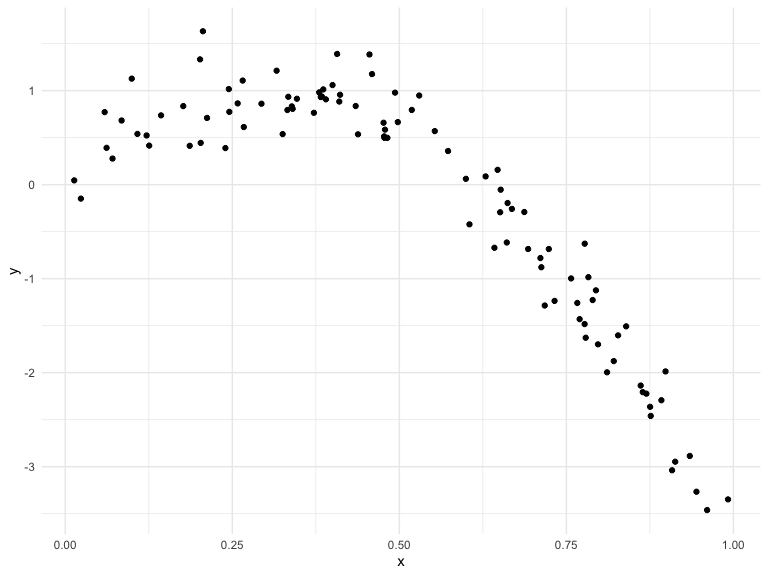
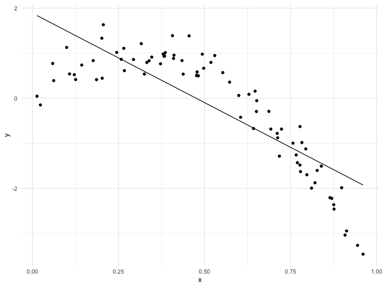
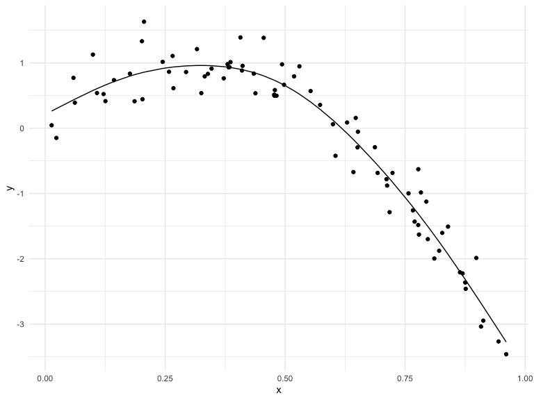
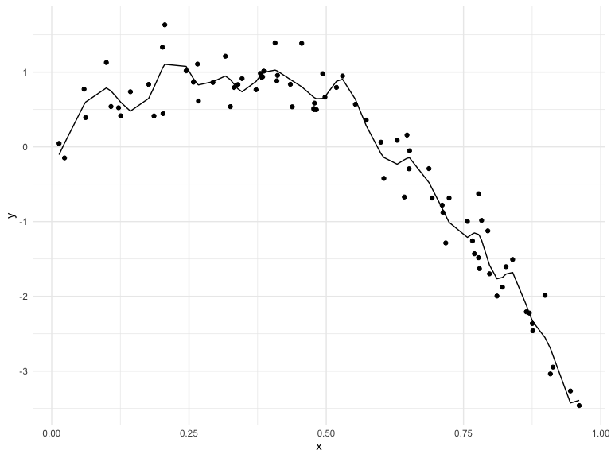
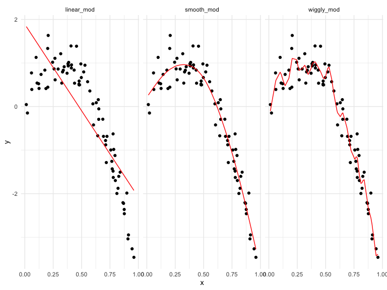

Linear Models
================

``` r
library(tidyverse)
```

    ## ── Attaching packages ─────────────────────────────────────── tidyverse 1.3.1 ──

    ## ✓ ggplot2 3.3.5     ✓ purrr   0.3.4
    ## ✓ tibble  3.1.4     ✓ dplyr   1.0.7
    ## ✓ tidyr   1.1.3     ✓ stringr 1.4.0
    ## ✓ readr   2.0.1     ✓ forcats 0.5.1

    ## ── Conflicts ────────────────────────────────────────── tidyverse_conflicts() ──
    ## x dplyr::filter() masks stats::filter()
    ## x dplyr::lag()    masks stats::lag()

``` r
library(viridis)
```

    ## Loading required package: viridisLite

``` r
library(modelr)
library(mgcv)
```

    ## Loading required package: nlme

    ## 
    ## Attaching package: 'nlme'

    ## The following object is masked from 'package:dplyr':
    ## 
    ##     collapse

    ## This is mgcv 1.8-38. For overview type 'help("mgcv-package")'.

``` r
knitr::opts_chunk$set(
  echo = TRUE,
  warning = FALSE, 
  fig.width = 8, 
  fig.height = 6, 
  out.width = "90%"
)
theme_set(theme_minimal() + theme(legend.position = "bottom"))

options(
  ggplot2.continuous.colour = "viridis",
  ggplot2.continuous.fill = "virids"
)

scale_colour_discrete = scale_color_viridis_d
scale_fill_discrete = scale_fill_viridis_d
```

## Simulate a dataset

-   set.seed() : important way to make sure to get the same thing every
    time when doing a process that involves randomness

``` r
set.seed(1)

nonlin_df = 
  tibble(
    id = 1:100,
    x = runif(100, 0, 1), 
    y = 1 - 10 * (x - .3) ^ 2 + rnorm(100, 0, .3)
  )

nonlin_df %>% 
  ggplot(aes(x = x, y = y)) +
  geom_point()
```



Cross validation - by hand

-   create splits by hand; plot; fit some models
-   train\_df taking 80% (80/100 observations)
-   test\_df needs to take the remaining 20%, not in the train\_df –
    looking for overlap by “id” variable

``` r
train_df = sample_n(nonlin_df, 80)
test_df = anti_join(nonlin_df, train_df, by = "id")

ggplot(train_df, aes(x = x, y = y)) + geom_point() + geom_point(data = test_df, color = "red")
```


fit models:

``` r
linear_mod = lm(y ~x, data = train_df)
smooth_mod = mgcv::gam(y ~ s(x), data = train_df)
wiggly_mod = mgcv::gam(y ~ s(x, k = 30), sp = 10e-6, data = train_df)
```

plot the results

-   linear model not complex enough
-   wiggly model is more complex than smooth model
-   putting too much into model

``` r
train_df %>% 
  add_predictions(linear_mod) %>% 
  ggplot(aes(x = x, y = y)) + 
  geom_point() + 
  geom_line(aes(y = pred))
```



``` r
train_df %>% 
  add_predictions(smooth_mod) %>% 
  ggplot(aes(x = x, y = y)) + 
  geom_point() + 
  geom_line(aes(y = pred))
```



``` r
train_df %>% 
  add_predictions(wiggly_mod) %>% 
  ggplot(aes(x = x, y = y)) + 
  geom_point() + 
  geom_line(aes(y = pred))
```



Adding all predictions to data frame and ‘pivoting’ so the result is a
tidy, ‘long’ dataset

``` r
train_df %>% 
  gather_predictions(linear_mod, smooth_mod, wiggly_mod) %>% 
  mutate(model = fct_inorder(model)) %>% 
  ggplot(aes(x = x, y = y)) + 
  geom_point() + 
  geom_line(aes(y = pred), color = "red") + 
  facet_wrap(~model)
```



Quantify the results

-   rmse: room mean square model
-   output seems to follow trends of graphs
-   problem - only done 1 80/20 split, maybe in general line would be ok
    or maybe wiggly would be ok
-   if get different 80/20 split can you check the results over and
    over? –&gt; iteration

``` r
rmse( linear_mod, test_df)
```

    ## [1] 0.7052956

``` r
rmse( smooth_mod, test_df)
```

    ## [1] 0.2221774

``` r
rmse( wiggly_mod, test_df)
```

    ## [1] 0.289051
