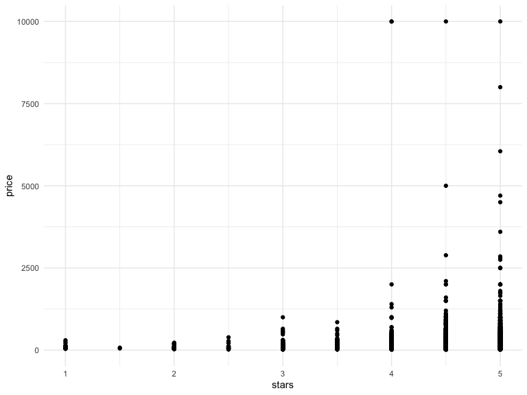

Linear Models
================

``` r
library(tidyverse)
```

    ## ── Attaching packages ─────────────────────────────────────── tidyverse 1.3.1 ──

    ## ✓ ggplot2 3.3.5     ✓ purrr   0.3.4
    ## ✓ tibble  3.1.4     ✓ dplyr   1.0.7
    ## ✓ tidyr   1.1.3     ✓ stringr 1.4.0
    ## ✓ readr   2.0.1     ✓ forcats 0.5.1

    ## ── Conflicts ────────────────────────────────────────── tidyverse_conflicts() ──
    ## x dplyr::filter() masks stats::filter()
    ## x dplyr::lag()    masks stats::lag()

``` r
library(p8105.datasets)
library(viridis)
```

    ## Loading required package: viridisLite

``` r
knitr::opts_chunk$set(
  echo = TRUE,
  warning = FALSE, 
  fig.width = 8, 
  fig.height = 6, 
  out.width = "90%"
)
theme_set(theme_minimal() + theme(legend.position = "bottom"))

options(
  ggplot2.continuous.colour = "viridis",
  ggplot2.continuous.fill = "virids"
)

scale_colour_discrete = scale_color_viridis_d
scale_fill_discrete = scale_fill_viridis_d
```

Load NYC Airbnb data.

``` r
data("nyc_airbnb")

nyc_airbnb = 
  nyc_airbnb %>% 
  mutate(stars = review_scores_location / 2) %>% 
  rename(
    borough = neighbourhood_group
  ) %>% 
  filter(borough != "Staten Island") %>% 
  select(price, stars, borough, neighbourhood, room_type)
```

Visualizaitons…

``` r
nyc_airbnb %>% 
  ggplot(aes(x = stars, y = price)) + geom_point()
```



Fitting linear model …

``` r
fit = lm(price ~ stars + borough, data = nyc_airbnb)
```

Look at fit …

``` r
summary(fit)
```

    ## 
    ## Call:
    ## lm(formula = price ~ stars + borough, data = nyc_airbnb)
    ## 
    ## Residuals:
    ##    Min     1Q Median     3Q    Max 
    ## -169.8  -64.0  -29.0   20.2 9870.0 
    ## 
    ## Coefficients:
    ##                  Estimate Std. Error t value Pr(>|t|)    
    ## (Intercept)       -70.414     14.021  -5.022 5.14e-07 ***
    ## stars              31.990      2.527  12.657  < 2e-16 ***
    ## boroughBrooklyn    40.500      8.559   4.732 2.23e-06 ***
    ## boroughManhattan   90.254      8.567  10.534  < 2e-16 ***
    ## boroughQueens      13.206      9.065   1.457    0.145    
    ## ---
    ## Signif. codes:  0 '***' 0.001 '**' 0.01 '*' 0.05 '.' 0.1 ' ' 1
    ## 
    ## Residual standard error: 181.5 on 30525 degrees of freedom
    ##   (9962 observations deleted due to missingness)
    ## Multiple R-squared:  0.03423,    Adjusted R-squared:  0.03411 
    ## F-statistic: 270.5 on 4 and 30525 DF,  p-value: < 2.2e-16

``` r
summary(fit)$coef
```

    ##                   Estimate Std. Error   t value     Pr(>|t|)
    ## (Intercept)      -70.41446  14.020697 -5.022180 5.137589e-07
    ## stars             31.98989   2.527500 12.656733 1.269392e-36
    ## boroughBrooklyn   40.50030   8.558724  4.732049 2.232595e-06
    ## boroughManhattan  90.25393   8.567490 10.534465 6.638618e-26
    ## boroughQueens     13.20617   9.064879  1.456850 1.451682e-01

``` r
fit %>% broom::tidy()
```

    ## # A tibble: 5 × 5
    ##   term             estimate std.error statistic  p.value
    ##   <chr>               <dbl>     <dbl>     <dbl>    <dbl>
    ## 1 (Intercept)         -70.4     14.0      -5.02 5.14e- 7
    ## 2 stars                32.0      2.53     12.7  1.27e-36
    ## 3 boroughBrooklyn      40.5      8.56      4.73 2.23e- 6
    ## 4 boroughManhattan     90.3      8.57     10.5  6.64e-26
    ## 5 boroughQueens        13.2      9.06      1.46 1.45e- 1

if you want to present output…

``` r
fit %>% 
  broom::tidy() %>% 
  mutate(term = str_replace(term, "borough", "Borough: ")) %>% 
  select(term, estimate, p.value) %>% 
  knitr::kable(digits = 3)
```

| term               | estimate | p.value |
|:-------------------|---------:|--------:|
| (Intercept)        |  -70.414 |   0.000 |
| stars              |   31.990 |   0.000 |
| Borough: Brooklyn  |   40.500 |   0.000 |
| Borough: Manhattan |   90.254 |   0.000 |
| Borough: Queens    |   13.206 |   0.145 |
